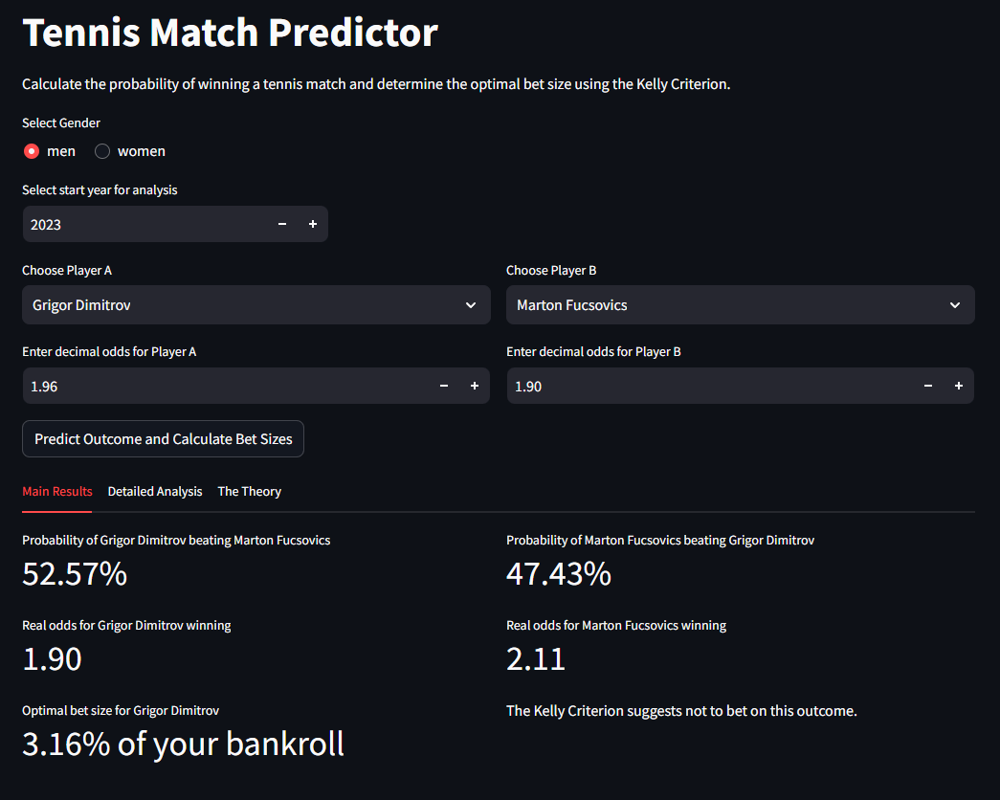

# Tennis Predictor (Web UI)

Go to the [Tennis Predictor Website](https://tennis-predictor.streamlit.app/). Select player A and provide the odds offered on the exchange/bookmaker, and do the same for player B. You can select a timeframe that will be used for the analysis, defaults to 2023. 

## Main Results

Within the `Main Results` tab you will see the % probability of each player to win, based on the common opponents they had in the timeframe selected. The bet sizes are calculated using the [Kelly Criterion](https://en.wikipedia.org/wiki/Kelly_criterion) formula. 

## Detailed Analysis

The `Detailed Analysis` tab is added for extra insights on how the statistics have been concluded to their results. You can see how many common opponents each player had, in the given timeframe, but also all matches they played including scoring. 

# CLI usage

In order to use it first extract the zip, then run the command `python -m pip install -r requirements.txt` in a terminal in the directory of the code.
You can bring up the help as to how to run the code by calling `python predictor.py -h`

A couple of examples: For probability of Roger Federer beating Novak Djokovic, run
`python predictor.py men "Roger Federer" "Novak Djokovic"`
(tip: adding '-vv' at the end will print on the screen some progress information, as the calculation can take some time (especially if downloading the files for the first time), 
and this way you have an idea of what's going on. So in this case it would be `python predictor.py men "Roger Federer" "Novak Djokovic" -vv`

For Serena Williams beating Venus Williams, it would be
`python predictor.py women "Serena Williams" "Venus Williams" -vv`

Be careful with the case of the text as I haven't implemented any checks. So "serena williams" would not work.

# Related theory
A common-opponent stochastic model for predicting the outcome of professional tennis matches by William J. Knottenbelt, Demetris Spanias and Agnieszka M. Madurska. 
Department of Computing, Imperial College London, South Kensington Campus, London, SW7 2AZ, United Kingdom. 

Source: [Science Direct](https://www.sciencedirect.com/science/article/pii/S0898122112002106)

# Datasets

- Dataset ATP: [JeffSackmann - tennis_atp](https://github.com/JeffSackmann/tennis_atp)
- Dataset WTP: [JeffSackmann - tennis_wta](https://github.com/JeffSackmann/tennis_wta)
